# Установка и настройка СУБД Microsoft SQL Server
## Этот проект является решением задания по установке и найстройке СУБД Microsoft SQL Server в котором рассматривается:
- Процесс установки СУБД Microsoft SQL Server
- Процесс установки утилиты SQL Server Management Studio
- Проверка работы ПО с помощью запросов к серверу с помощью SQLCMD и SQL Server Management Studio.
### Процесс установки СУБД Microsoft SQL Server
#### Шаг 1. Переходим на сайт www.microsoft.com
На сайте Microsoft SQL Server нам предлагается скачать экземляры SQL Server версии Developer и Express.
Для учебных целей можно смело выбирать Express, т.к. он содержит все необходимые для разработки малых приложений средства.

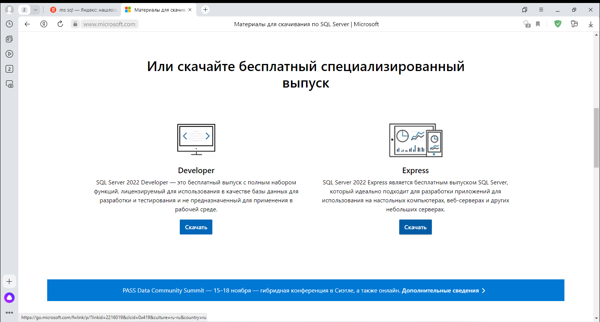
#### Шаг 2. Запускаем программу установки Microsoft SQL Server.
Так как целью нашего задания является установка Microsoft SQL Server без каких либо поправок в его конфигурацию при установке и его настройка из 3-х предложенных типов установки мы выберем "Базовый".

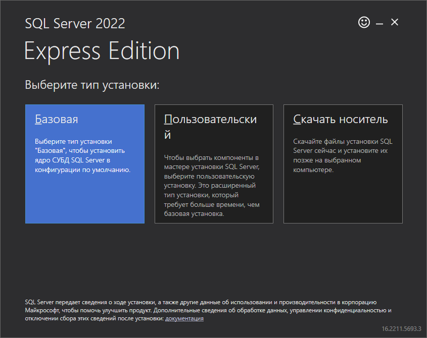
#### Шаг 3. Принятие лицензионного соглашения.
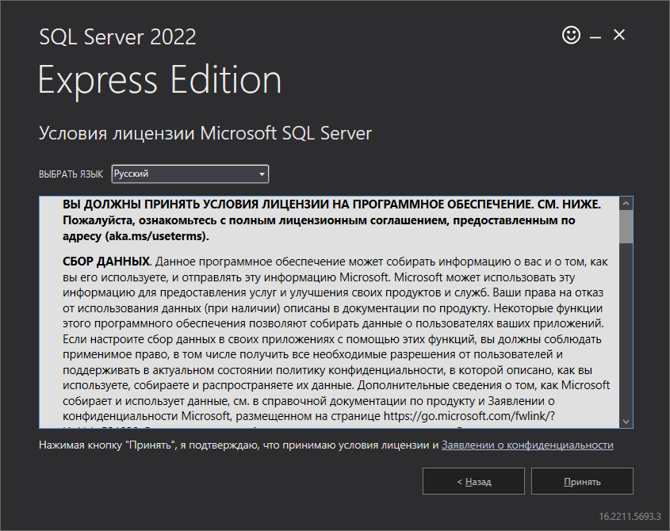
#### Шаг 4. Выбор места установки Microsoft SQL Server
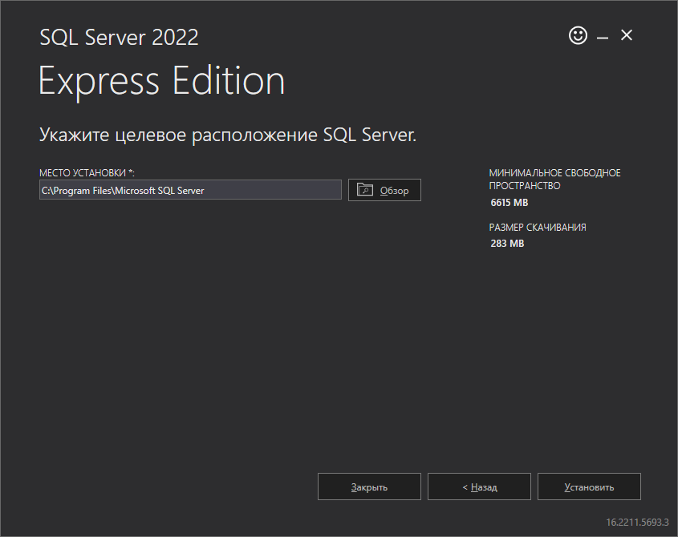
#### Шаг 5. Ожидаем скачивания и установки всех базовых компонентов ПО.
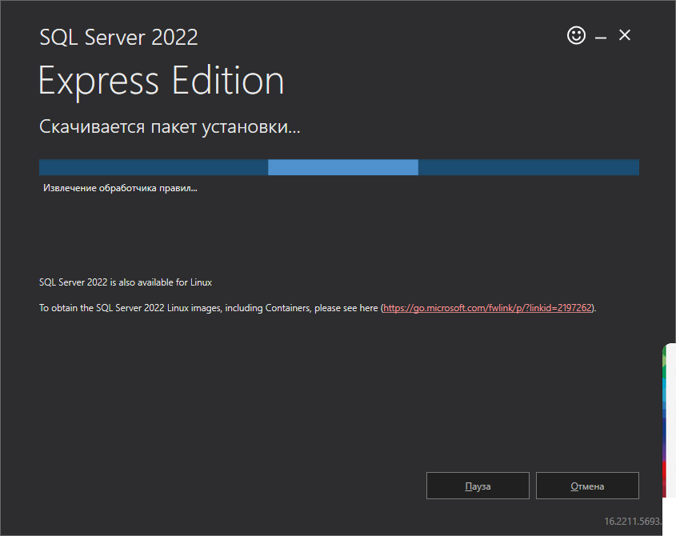
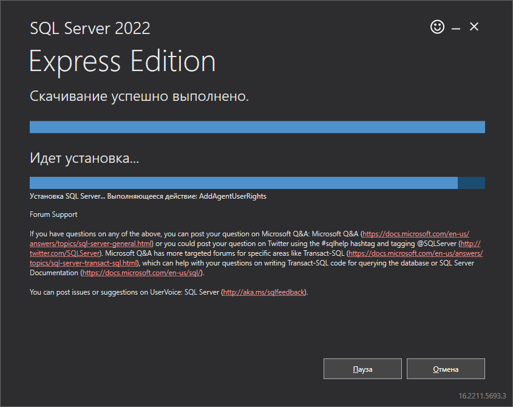
#### Установка успешно выполнена.
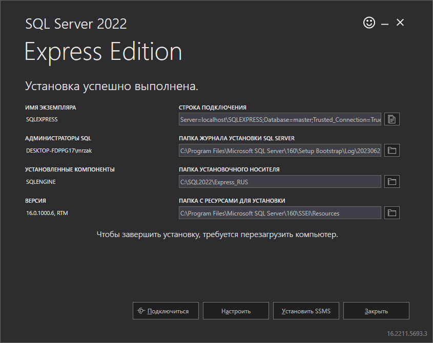
#### Дополнительные возможности
После установки Microsoft SQL Server установщик предложит нам установить SQL Server Management Studio (SSMS).
Эта утилита может существенно упростить процесс управления СУБД Microsoft SQL Server благодаря простому и понятному графическому интерфейсу утилиты, графическим представлениям баз данных (моделируя ER-диаграмму базы данных в представления утилита предложит создать недостающие таблицы и связи, что избавит конечного пользователя от написания кода вручную) и широкой документации продукта от Microsoft.

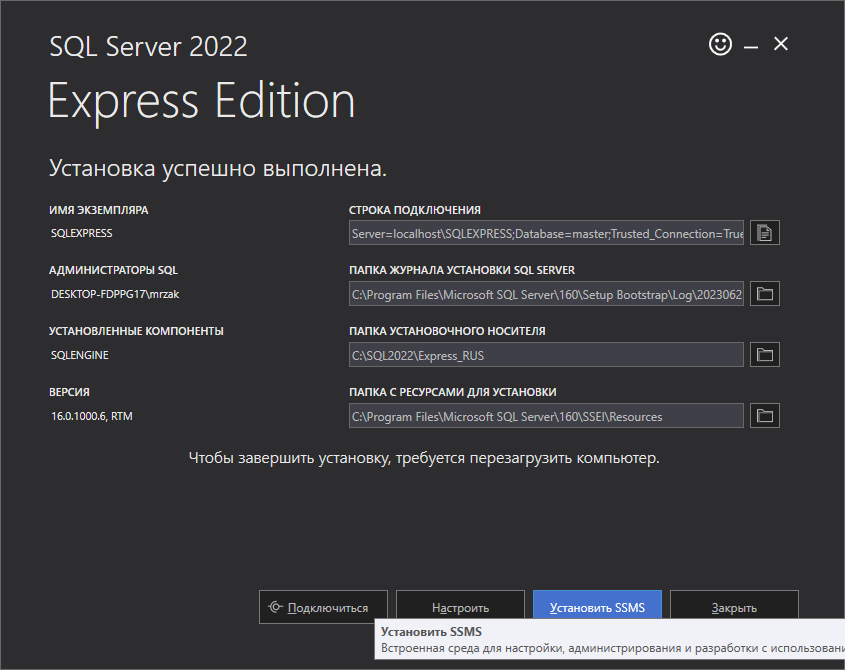
### Процесс установки утилиты SQL Server Management Studio
#### Шаг 1. Переходим на сайт www.microsoft.com. Скачивание SQL Server Management Studio (SSMS).
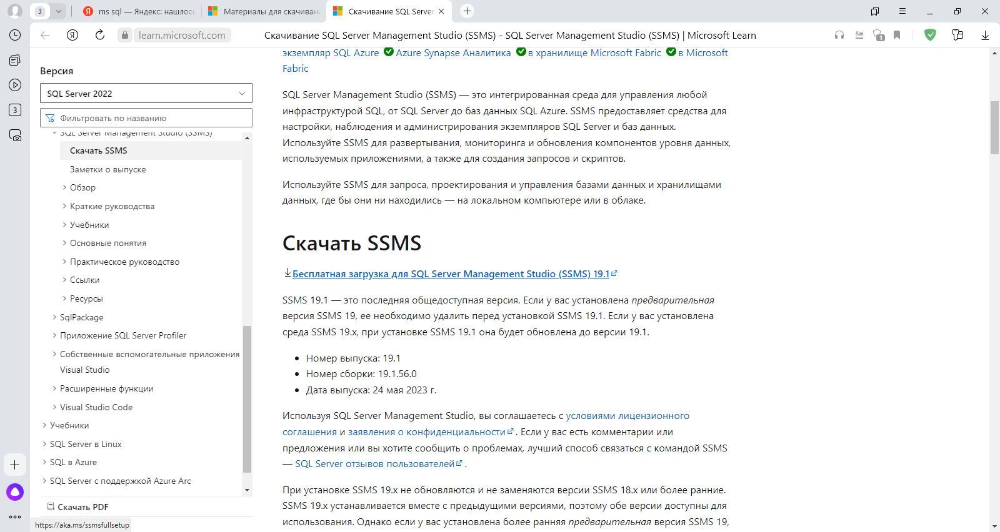
#### Шаг 2. Запускаем программу установки SQL Server Management Studio. Выбираем место установки SSMS.
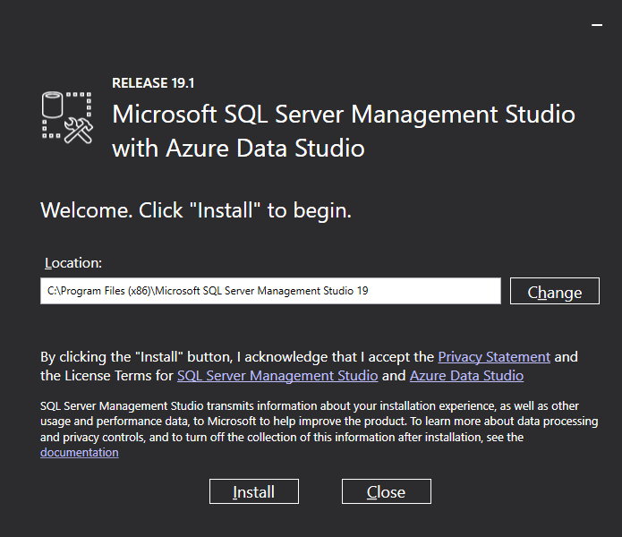
#### Шаг 3. Дожидаемся установки всех основных компонентов SSMS.
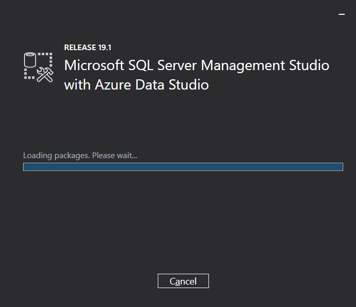
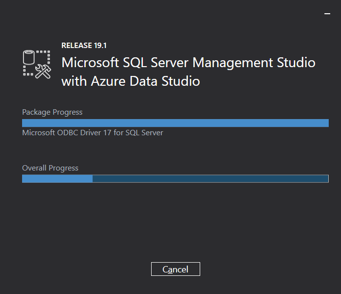
#### SSMS Установлена.
Теперь мы можем перейти к проверке работоспособности программного обеспечения

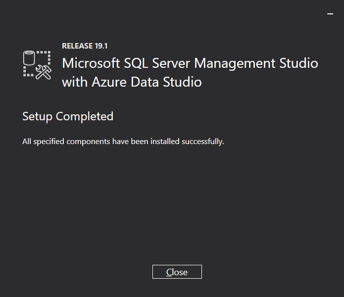
### Проверка работы ПО с помощью запросов к серверу с помощью SQLCMD и SQL Server Management Studio.
#### Создаём скрипт в формате .sql для создания базы данных.
Создаём скрипт для создания базы данных и сохраняем его в файле с расширением .sql

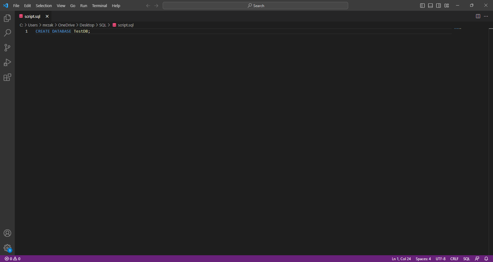
#### Для выполнения скрипта используем утилиту SQLCMD, которая устанавливается при установке SQL Server.
Для выполнения скрипта необходимо сообщить 2 параметра: имя сервера (-S) и местоположение скрипта (-i).
На скриншоте изображен результат работы программы.

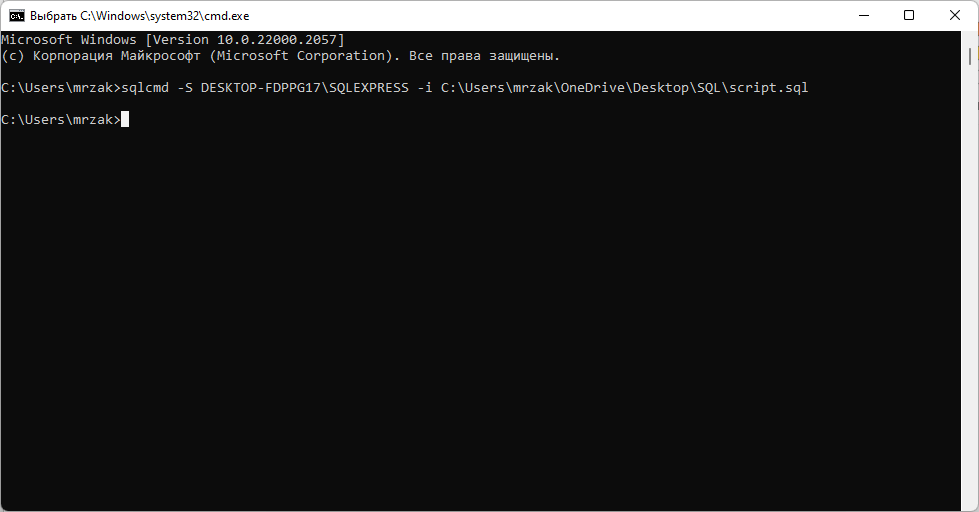
#### изменяем содержимое скрипта. Создаём таблицу в нашей базе данных и заполняем значениями.
Для создания таблицы в T-SQL используется команда CREATE TABLE();
Внутри тела команды можно указать имена полей таблицы, типы данных полей и модификаторы:
- NOT NULL - обязывает запись содержать значение в данном поле;
- UNIQUE - обязывает значение в данном поле быть уникальным среди значений данного поля в других записей таблицы.
- PRIMARY KEY - устанавливает первичный ключ для поля(полей) таблицы.
- IDENTITY (1,1) - аналог AUTOINCREMENT в стандартном SQL, при добавлении записи поле заполняется счётчиком. Это значит, что поле заполняется не в зависимости от наибольшего значения поля в таблице (записи могут и удаляться), а в зависимости от текущего значения счётчика поля в таблице.
Для добавления записей в таблицу используем конструкцию INSERT INTO.
Для исполнения команды добавления записи указывается таблица ("TestTable1"), список полей для вставки (данный параметр может пропускаться - это означает что мы вводим все поля в таблицу), и список значений в том же порядке, что и список полей записи (если мы список не указывали, то в порядке расположения полей в таблице).

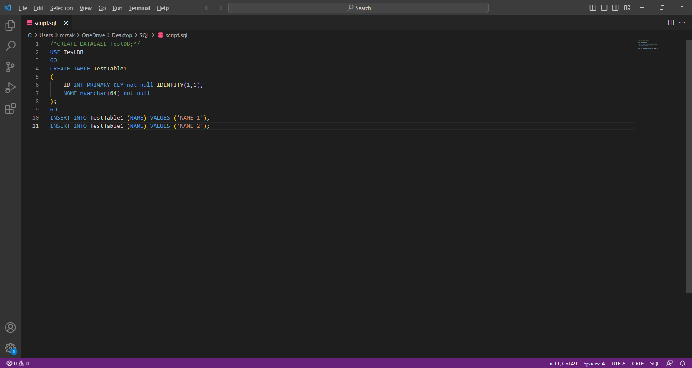
SQLCMD сигнализирует о смене контекста БД на "TestDB", что является результатом работы команды USE TestDB(имя базы данных).
Об успешном выполнении добавления записей в таблицу TestTable1 свидетельствуют логи "(обработано строк:1)" - по одному на каждую команду INSERT INTO.

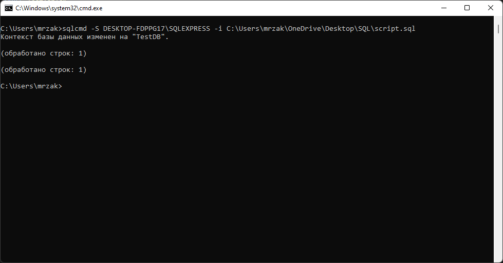
#### Проверим результат через SQL Server Management Studio.
Для входа в SSMS в нашем случае необходимо указать лишь имя сервера (SSMS предложит выбрать его сама). Когда речь идёт об удалённом сервере, необходимо будет указывать имя пользователя и пароль от учётной записи для доступа к серверу.

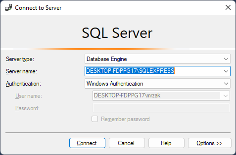
#### Режим редактирования данных.
При вызове контекстного меню по клику правой кнопкой мыши на таблицу, кликаем на пункт "Edit Top 200 Rows" - в данном режиме можно и прасматривать и редактировать данные таблицы.
Данные таблицы приведены на скриншоте.

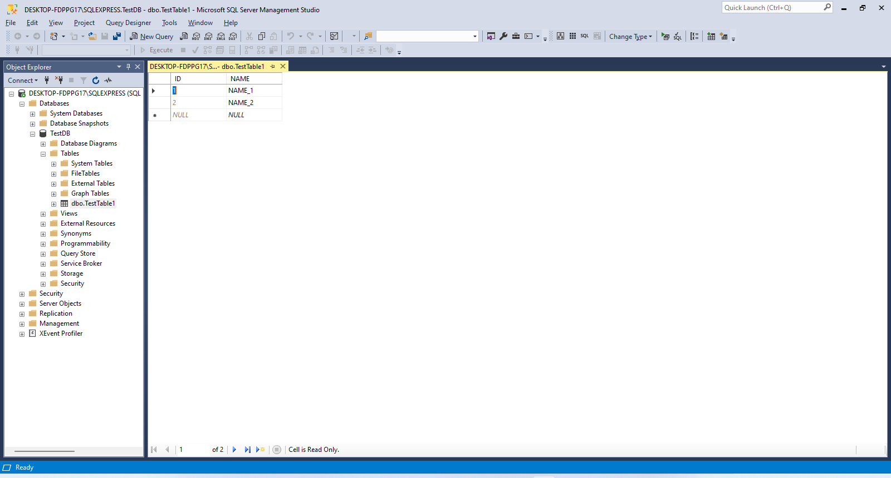
#### Проверим данные через SQLCMD.
Изменим скрипт, закомментировав предыдущий код.
Для осуществления выборки используем команду SELECT.
Данная команда позволяет создавать различные выборки данных по множеству таблиц (INNER JOIN, OUTER JOIN) с использованием фильтров (WHEN, LIKE) и сортировок (ORDER BY).
В нашем случае мы выводим все данные таблицы TestTable1. Оператор "*" указывает на то, что выборка должна осуществляться по всем полям таблицы.

Результат выполнения скрипта.

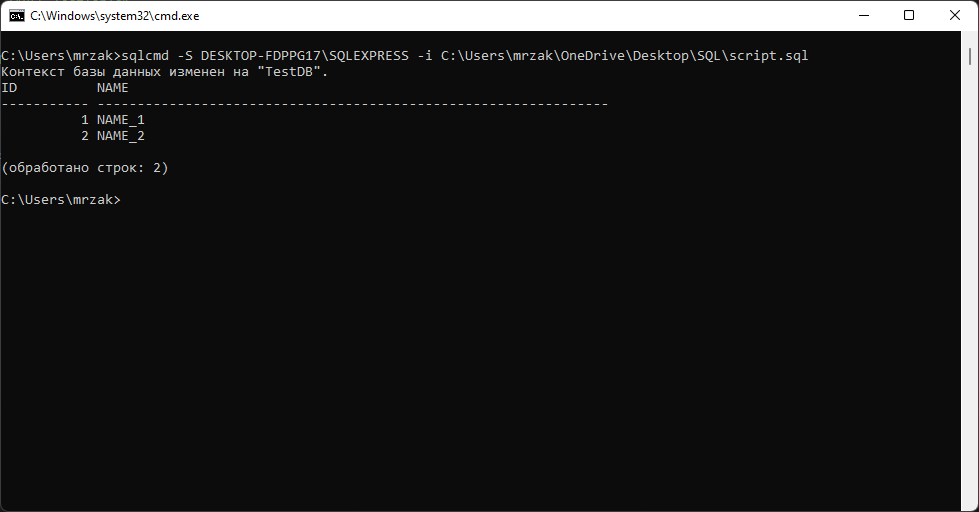
## Установка и проверка работоспособности ПО успешно завершена.
